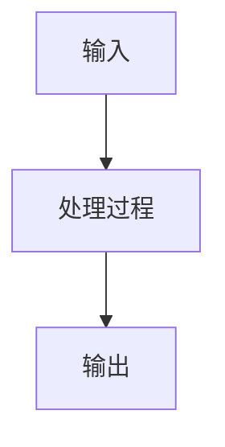
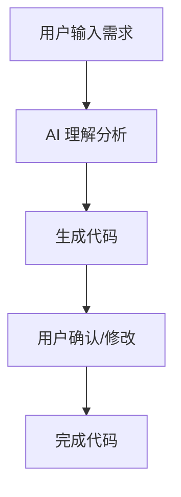
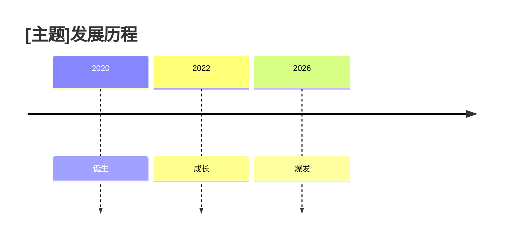
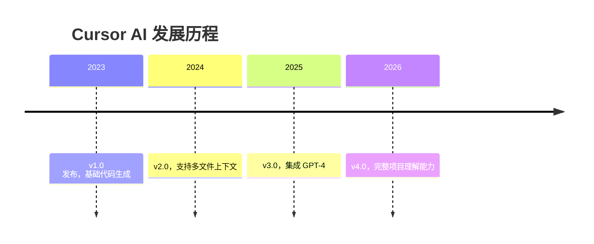

# 视觉元素增强指南

## 配图建议系统

### 图片类型与位置

#### 1. 封面图（开头钩子后）

**时机：** 在钩子开头结束后，立即插入

**建议提示词：**
```
配图建议：一张吸引眼球的封面图
- 风格：科技感、现代简洁
- 色调：蓝紫色系为主
- 内容：体现[主题]的核心特点
- 构图：中心对称，留有标题空间
```

**示例：**
```
配图建议：一张吸引眼球的封面图
- 风格：科技感、现代简洁
- 色调：蓝紫色系为主
- 内容：AI 编程助手的概念图，人机协作场景
- 构图：中心对称，留有标题空间
```

---

#### 2. 功能示意图（核心价值章节后）

**时机：** 在介绍完核心价值/功能后

**建议提示词：**
```
配图建议：信息图表
- 类型：功能架构图或工作流程图
- 内容：展示[主题]的主要功能模块
- 风格：扁平化设计，清晰的层级关系
- 颜色：使用2-3种主色调，保持一致
```

**示例：**
```
配图建议：信息图表
- 类型：Cursor AI 的功能架构图
- 内容：展示代码生成、解释、修复三大功能模块
- 风格：扁平化设计，清晰的层级关系
- 颜色：蓝色+橙色，保持与封面一致
```

---

#### 3. 原理图解（关键信息章节）

**时机：** 在解释工作原理时

**建议提示词：**
```
配图建议：流程图或架构图
- 类型：技术原理流程图
- 内容：展示[主题]的工作原理/处理流程
- 风格：简洁清晰，易于理解
- 细节：标注关键步骤和组件
```

**示例：**
```
配图建议：流程图
- 类型：Cursor AI 的代码生成流程
- 内容：用户输入 → AI 理解 → 代码生成 → 结果输出
- 风格：简洁清晰，箭头连接
- 细节：标注每个步骤的关键技术
```

---

#### 4. 对比图（对比分析时）

**时机：** 在进行竞品对比时

**建议提示词：**
```
配图建议：对比图
- 类型：前后对比或并排对比
- 内容：传统方案 vs [主题]的效果对比
- 风格：左右分屏或上下对比
- 标注：突出关键差异点
```

**示例：**
```
配图建议：对比图
- 类型：传统编程 vs AI 辅助编程的效率对比
- 内容：左侧：手写代码耗时；右侧：AI 生成代码秒完成
- 风格：左右分屏，使用进度条或时间轴
- 标注：标注效率提升倍数
```

---

#### 5. 案例截图（应用场景/案例展示）

**时机：** 在展示具体使用案例时

**建议提示词：**
```
配图建议：实际使用截图
- 内容：[主题]的界面截图或操作步骤
- 标注：关键功能和操作用箭头/框标注
- 质量：清晰的截图，适当裁剪
- 说明：配简短的文字说明
```

**示例：**
```
配图建议：实际使用截图
- 内容：Cursor AI 的代码生成界面
- 标注：用红框标注 AI 输入区域和生成结果
- 质量：高清截图，突出重点区域
- 说明：配文字"在输入框描述需求，AI 自动生成代码"
```

---

### 图片生成提示词模板

#### 通用封面图模板

```
A modern, tech-themed cover image for [TOPIC],
minimalist design with blue and purple gradient,
center composition with space for title,
clean and professional style, 4k resolution
```

#### 功能架构图模板

```
An infographic diagram showing [TOPIC]'s architecture,
flat design with 2-3 main color schemes,
clear hierarchical structure with labeled components,
professional business presentation style
```

#### 工作流程图模板

```
A clean flowchart showing [TOPIC]'s workflow,
arrow connections between steps,
key components labeled with text boxes,
minimalist technical diagram style
```

---

## 代码块使用规范

### 何时使用代码块

✅ **适合使用代码块：**
- 展示配置示例
- 演示 API 调用
- 对比技术实现
- 展示代码片段
- Before/After 对比

❌ **不适合使用代码块：**
- 大段纯文字说明
- 非技术性的列表
- 一般性描述文字

---

### 代码块格式规范

#### 格式模板

````markdown
```语言类型
代码内容
```
````

**在代码块前加简短说明：**
```
示例：[这段代码的作用]

```python
def hello():
    print("Hello, World!")
```
```

---

#### 常用语言类型标签

```markdown
- Python → ```python
- JavaScript → ```javascript
- TypeScript → ```typescript
- Java → ```java
- C++ → ```cpp
- Go → ```go
- Rust → ```rust
- Shell → ```bash
- SQL → ```sql
- JSON → ```json
- YAML → ```yaml
- 通用代码 → ```
```

---

### 代码块最佳实践

#### 1. 添加说明文字

```markdown
示例：使用 Cursor AI 生成登录功能

```python
# 用户只需要输入需求，AI 自动生成以下代码

def login(username, password):
    # 验证用户名和密码
    if authenticate(username, password):
        return {"status": "success", "token": generate_token()}
    else:
        return {"status": "failed", "message": "Invalid credentials"}
```
```

#### 2. Before/After 对比

```markdown
**传统方式：手动编写（耗时 10 分钟）**

```python
# 手写每个函数...
def add(a, b):
    return a + b
# ...更多代码
```

**使用 Cursor：描述需求（耗时 30 秒）**

```python
# 需求：创建一个计算器类，支持加减乘除
class Calculator:
    def add(self, a, b): return a + b
    def subtract(self, a, b): return a - b
    def multiply(self, a, b): return a * b
    def divide(self, a, b): return a / b
```
```

#### 3. 关键代码高亮说明

```markdown
```python
# Cursor AI 的核心优势：理解上下文

def process_data(data):
    # ✅ AI 理解这是数据处理函数
    result = transform(data)

    # ✅ 根据项目上下文，自动导入正确的模块
    from project.utils import transform

    return result
```
```

---

## 引用使用规范

### 四种引用样式

#### 样式1：强调观点

```markdown
> 💡 **核心观点**：[要强调的内容]
```

**示例：**
```markdown
> 💡 **核心观点**：AI 编程工具不是为了替代程序员，
> 而是为了让程序员专注于更有价值的创造性工作。
```

---

#### 样式2：引用原文

```markdown
> 📖 **官方定义**：[引用的内容]
```

**示例：**
```markdown
> 📖 **官方定义**：Cursor 是一个"AI-first 的代码编辑器"，
> 将 AI 能力深度集成到编辑器的每一个功能中。
```

---

#### 样式3：注意事项

```markdown
> ⚠️ **注意**：[提醒读者注意的内容]
```

**示例：**
```markdown
> ⚠️ **注意**：Cursor AI 目前需要联网使用，
> 确保你的网络连接稳定。
```

---

#### 样式4：技巧分享

```markdown
> 💡 **实用技巧**：[分享的小技巧]
```

**示例：**
```markdown
> 💡 **实用技巧**：按 `Ctrl+K` 可以快速打开 AI 面板，
> 按 `Ctrl+L` 可以与 AI 对话讨论代码。
```

---

## 图表生成建议

### 流程图（Mermaid）

**时机：** 解释工作原理、处理流程时

**模板：**
```markdown

```

**示例：**
```markdown

```

---

### 对比表

**时机：** 功能对比、竞品对比时

**模板：**
```markdown
| 特性 | 传统方案 | [主题] |
|------|----------|--------|
| 效率 | 低 | 高 |
| 成本 | 高 | 低 |
```

**示例：**
```markdown
| 特性 | 传统编程 | Cursor AI |
|------|----------|-----------|
| 代码生成 | 手写 | AI 自动生成 |
| Bug 定位 | 手动查找 | AI 智能定位 |
| 学习曲线 | 陡峭 | 平缓 |
| 效率提升 | 基准 | 3倍 |
```

---

### 时间线

**时机：** 发展历程、版本演进时

**模板：**
```markdown

```

**示例：**
```markdown

```

---

## 视觉节奏控制

### 视觉元素密度原则

**目标：** 保持良好的阅读节奏，避免大段纯文字

**规则：**
- ✅ 每300字必须有视觉元素
- ✅ 避免连续3段纯文字
- ✅ 重要内容独立成段并加粗
- ✅ 使用列表、引用、代码块等丰富形式

---

### 视觉元素组合示例

#### 示例1：理论+引用+列表

```markdown
[一段理论解释，约150字]

> 💡 **核心概念**：[用引用强调核心概念]

[列表形式的展开]
- 要点1
- 要点2
- 要点3
```

#### 示例2：对比+表格

```markdown
[介绍两种方案，约200字]

[对比表格]
| 特性 | 方案A | 方案B |
|------|-------|-------|
| ...  | ...   | ...   |

[总结分析，约100字]
```

#### 示例3：原理+流程图+代码

```markdown
[原理说明，约150字]

[流程图]


[代码示例]
```python
# 示例代码
```
```

---

## 配置检查清单

在完成文章后，检查视觉元素：

### 配图检查
- [ ] 开头有封面图建议
- [ ] 功能章节有示意图建议
- [ ] 原理章节有流程图建议
- [ ] 对比/案例有相应图片建议

### 代码块检查
- [ ] 代码块有语言标签
- [ ] 代码块前有说明文字
- [ ] 代码格式正确（无语法错误）
- [ ] 关键部分有注释

### 引用检查
- [ ] 引用样式使用恰当
- [ ] 引用内容准确
- [ ] 引用前后有过渡
- [ ] 避免过度使用

### 图表检查
- [ ] 表格格式正确
- [ ] 流程图逻辑清晰
- [ ] 对比维度合理
- [ ] 数据准确

### 整体检查
- [ ] 每300字有视觉元素
- [ ] 避免连续3段纯文字
- [ ] 视觉元素与内容匹配
- [ ] 整体风格统一
